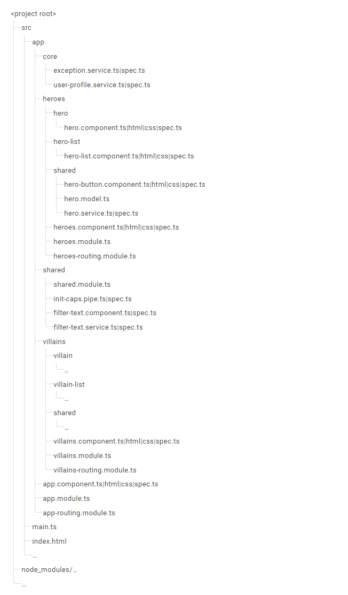

<div id="top"></div>

<!-- PROJECT LOGO -->
<br />
<div align="center">
  <a href="https://github.com/othneildrew/Best-README-Template">
    
  </a>

  <h2 align="center">A Hobbit's Developer Angular Style Guide</h2>

  <p align="center">
    A style guide for the layman developer.You want the spark notes? You got it!
    <br />
    <a href="https://github.com/coltskeen/Style-Guide">Style Guide Overview</a>
    ·
    <a href="https://github.com/coltskeen/Style-Guide/issues">Report Bug</a>
    ·
    <a href="https://github.com/coltskeen/Style-Guide/issues">Request Feature</a>
  </p>
</div>

> ### "Arguments over style are pointless. There should be a style guide, and you should follow it"
> &emsp;_Rebecca_ _Murphey_

<!-- TABLE OF CONTENTS -->
<details>
  <summary id="table-of-contents">Table of Contents</summary>
  <ol>
    <li><a href="#angular-style-guide">Angular Style Guide</a></li>
      <ul>
        <li><a href="#note-on-consistency">Note on Consistency</a></li>
        <li><a href="#single-responsibility-principle">Single Responsibility Principle</a></li>
        <li><a href="#angular-naming-conventions">Angular Naming Conventions</a></li>
        <li><a href="#application-structure">Application Structure</a></li>
        <li><a href="#components">Components</a></li>
        <li><a href="#services">Services</a></li>
        <li><a href="#lifecycle-hooks">Lifecycle Hooks</a></li>
      </ul>
    <li><a href="#resources">Resources</a></li>
    <li><a href="#copyright">Copyright</a></li>
    <li><a href="#amendments">Amendments</a></li>
  </ol>
</details>

# Angular Style Guide

This section is derived from the official [Angular Style Guide](https://angular.io/guide/styleguide). It contains highlights that Angular developers should consider following - unless you have a significant reason to deviate. Again this is not comprehensive of all rules recommended in the official style guide but the spark notes version. 

## Note on Consistency

For any style question that isn't settled definitively by this styleguide, do what the other code in the same file is already doing (be consistent). If that doesn't resolve the question, consider emulating the other files in the same directory. At all times, remember that code reviewers should not focus on simply enforcing the rules in this styleguide, but instead focus on improving overall code quality.

**[⬆ back to top](#table-of-contents)**

## Single Responsibility Principle

  * **Rule:** Define one thing, such as a service or component, per file, and consider limiting files to 300 lines of code.
  * **Reason:** Avoids bugs and makes code easier to read and maintain.

    ```ts
    // bad - the model should be separated to its own file
    import { Component, OnInit } from '@angular/core';

    interface Hero {
      id: number;
      name: string;
    }

    @Component({
      selector: 'app-root',
      templateUrl: './hero-button.component.html'
      styleUrls: ['app/app.component.css']
    })
    class AppComponent implements OnInit {
      title = 'Tour of Heroes';

      heroes: Hero[] = [];

      ngOnInit() {
        getHeroes().then(heroes => (this.heroes = heroes));
      }
    }
    ```

  * **Rule:** Keep functions small. Consider limiting them to no more than 30 lines.
  * **Reason:** Avoids bugs and makes code easier to read and maintain.

**[⬆ back to top](#table-of-contents)**

## Angular Naming Conventions

  * **Rules:** 
      * Be consistent with file names. Use the angular recommended pattern `feature.type.ts`.
      * Use dashes and dots to separate names. Don't abbreviate the types.
  * **Reason:** Increases team efficiency by making files clear and easier to find.

    ```ts
    // bad
    heroList.component.ts
    hero-list.comp.ts

    // good
    hero-list.component.ts
    ```

  * **Rule:** Class names should be upper camel case and match the name of the file.
  * **Reason:** Consistent conventions make it easy to quickly identify and reference assets of different types.

    ```ts
    @Component({ … }) 
    export class HeroListComponent { } // Filename matches -> hero-list.component.ts
    ```

  * **Rule:** Do use _dashed-case_ for naming the element selectors of components.
  * **Reason:** Keeps the element names consistent with the specification for custom elements.

    ```ts
    // bad
    @Component({
      selector: 'tohHeroButton',
      templateUrl: './hero-button.component.html'
    })
    export class HeroButtonComponent {}

    // good
    @Component({
      selector: 'toh-hero-button',
      templateUrl: './hero-button.component.html'
    })
    export class HeroButtonComponent {}
    ```

  * **Rule:** Do use lower camel case for directives selectors.
  * **Reason:** The Angular HTML parser is case-sensitive and recognizes lower camel case.

    ```ts
    // good
    @Directive({
      selector: '[tohValidate]'
    })
    export class ValidateDirective {}
    ```

  * **Rule:** Unit test file names should be the same as the component they test but with the `.spec` suffix.
  * **Reason:** Provides pattern matching for `karma` or other test runners.

    ```ts
    // good
    hero-list.component.spec.ts
    ```


## Application Structure

  * **Rules:** 
      * Put all the application's code in the `src` folder but separate out all feature areas within this folder with their own NgModule.
      * All third party scripts should be stored in another folder (not the `src` folder).
      * Follow the LIFT principles. Structure the application such that you can **L**ocate code quickly, **I**dentify the code at a glance, keep the **F**lattest structure you can, and **T**ry to be DRY
      * Create folders by the feature area they represent such as `hero` or `villian`.
      * Create NgModules for the root module, each feature module, and the shared module. 
  * **Reason:** Consistency and avoiding clutter in your codebase as you scale the project.

_Figure 1: Example Folder Stucture:_

  


**[⬆ back to top](#table-of-contents)**

## Components

  * **Rule:** Give components an _element_ selector instead an attribute or class selector.
  * **Reason:** Easier to recognize that it is a component in the template's html.

    ```ts
    // bad
    <div tohHeroButton></div>

    // good 
    <toh-hero-button></toh-hero-button>
    ```

  * **Rule:** Always extract templates and styles into a separate file.
  * **Reason:** Large, inline templates and styles obscure the component's purpose and implementation, reducing readability and maintainability.

    ```ts
    // bad
    @Component({
      selector: 'toh-heroes',
      template: `
        <div>
          <h2>My Heroes</h2>
          <ul class="heroes">
            <li *ngFor="let hero of heroes | async" (click)="selectedHero=hero">
              <span class="badge">{{hero.id}}</span> {{hero.name}}
            </li>
          </ul>
          <div *ngIf="selectedHero">
            <h2>{{selectedHero.name | uppercase}} is my hero</h2>
          </div>
        </div>
      `,
      styles: [`
        .heroes { ... }
        .heroes li { ... }
        .heroes .badge { ... }
      `]
    })
    export class HeroesComponent {
      heroes: Observable<Hero[]>;
      selectedHero!: Hero;

      constructor(private heroService: HeroService) {
        this.heroes = this.heroService.getHeroes();
      }
    }

    // good
    @Component({
      selector: 'toh-heroes',
      templateUrl: './heroes.component.html',
      styleUrls:  ['./heroes.component.css']
    })
    export class HeroesComponent {
      heroes: Observable<Hero[]>;
      selectedHero!: Hero;

      constructor(private heroService: HeroService) {
        this.heroes = this.heroService.getHeroes();
      }
    }
    ```

**[⬆ back to top](#table-of-contents)**

  * **Rule:** Place properties up top in the file, followed by methods. Private members go after the public members.
  * **Reason:** Consistency in the sequence helps with readability.

    ```ts
    // bad
    export class ToastComponent implements OnInit {
      // properties and fields mixed up
      private defaults = { ... };
      message: string;
      title: string;
      private toastElement: any;

      // public and private methods mixed up
      ngOnInit() { ... }
      private hide() { ... }
      activate(message = this.defaults.message, title = this.defaults.title) { ... }
      private show() { ... }
    }

    // good
    export class ToastComponent implements OnInit {
      // public properties
      message = '';
      title = '';

      // private fields
      private defaults = { ... };
      private toastElement: any;

      // public methods
      activate(message = this.defaults.message, title = this.defaults.title) { ... }
      ngOnInit() { ...  }

      // private methods
      private hide() { ... }
      private show() { ... }
    }
    ```

  * **Rules:** 
      * Limit logic in a component to only that required for the view. All other logic should be delegated to services. 
      * Move reusable logic to services and keep components simple and focused on their intended purpose.
  * **Reason:** More easily reusable logic that can be more easily isolated for unit testing.

    ```ts
    // bad
    export class HeroListComponent implements OnInit {
      heroes: Hero[];
      constructor(private http: HttpClient) {}
      getHeroes() {
        this.heroes = [];
        this.http.get(heroesUrl).pipe(
          catchError(this.catchBadResponse),
          finalize(() => this.hideSpinner())
        ).subscribe((heroes: Hero[]) => this.heroes = heroes);
      }
      ngOnInit() {
        this.getHeroes();
      }

      private catchBadResponse(err: any, source: Observable<any>) { ... }
      private hideSpinner() { ... }
    }
    
    // good
    import { Component, OnInit } from '@angular/core';
    // put logic in the service and import it
    import { Hero, HeroService } from '../shared';

    @Component({ ... })
    export class HeroListComponent implements OnInit {
      heroes: Hero[] = [];
      constructor(private heroService: HeroService) {}
      getHeroes() {
        this.heroes = [];
        this.heroService.getHeroes()
          .subscribe(heroes => this.heroes = heroes);
      }
      ngOnInit() {
        this.getHeroes();
      }
    }
    ```

**[⬆ back to top](#table-of-contents)**

## Services

  * **Rules:** 
      * Use services as singletons within the same injector. Use them for sharing data and functionality.
      * Maintain single responsibility encapsulated by context in services.
      * Provide services in the root injector in the `@Injectable` decorator of the service
  * **Reason:** Services are ideal for sharing methods, instances, and stateful in-memory data.

**[⬆ back to top](#table-of-contents)**

## Lifecycle Hooks

  * **Rule:** Implement lifecycle hooks interfaces.
  * **Reason:** It helps with flagging misspellings or syntax errors.

    ```ts
    // bad
    export class HeroButtonComponent {
      onInit() { // misspelled
        console.log('The component is initialized');
      }
    }

    // good
    export class HeroButtonComponent implements OnInit {
      ngOnInit() {
        console.log('The component is initialized');
      }
    }
    ```

**[⬆ back to top](#table-of-contents)**


# Resources

**Read This**

  - [Angular Style Guide](https://angular.io/guide/styleguide)

**Tools**

  - Code Style Linter - [ESlint](https://eslint.org/)
  - Client-side Framework - [Angular](https://angular.io/docs)
  - Angular Testing
    - [Karma](https://angular.io/guide/testing)
    - [Jasmine](https://jasmine.github.io/pages/docs_home.html)

**Further Reading**

  - [Frontend Guidelines](https://github.com/bendc/frontend-guidelines) - Benjamin De Cock

**Books**

  - [Angular - The Complete Guide](https://www.oreilly.com/library/view/angular-the/9781788998437/) - Maximilian Schwarzmuller


**[⬆ back to top](#table-of-contents)**

# Copyright

Copyright (c) 2022 The Wizard

**[⬆ back to top](#table-of-contents)**

# Amendments

To propose changes to this style guide please submit a pull request for peer review.

**[⬆ back to top](#table-of-contents)**